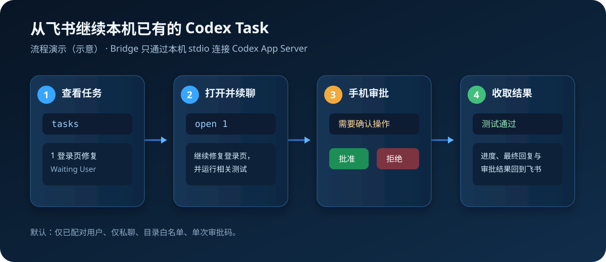

# Feishu Codex Bridge


> 离开电脑后，用自己的飞书机器人安全续聊本机已有的 Codex Task。

支持继续由 **Codex Desktop 或 Codex CLI** 创建的 Task；可在手机上查看状态、补充指令并批准单次操作。项目运行在自己的 Windows 电脑上，不托管 Codex 凭证，也不暴露 Codex App Server 网络端口。

> Bridge 运行时需要已安装并登录的 Codex CLI（使用 `codex app-server`）；Codex Desktop 创建的 Task 同样可以被继续。

## 三分钟开始

适用于 Windows 10/11，准备好飞书账号和可用网络后运行：

```powershell
npm install -g @tianniansz/feishu-codex-bridge
feishu-codex-bridge setup
```

安装向导会检查 Node.js 20+、Codex CLI、飞书官方 `lark-cli`，引导选择自己的飞书机器人和允许远程操作的目录；完成后会自动启动 Bridge 并生成一次性配对码。

```text
pair 123456
tasks
open 1
继续完成这个任务，并运行相关测试
```

从 `0.2.2` 起，后续升级使用：

```powershell
feishu-codex-bridge upgrade
```

## 流程演示



> 上图是操作流程示意，不是飞书产品截图。真实使用时，Task、进度、单次审批和最终结果均在你的飞书会话中呈现。

## 功能

- 搜索、按项目过滤并分页查看允许目录内的 Codex Task
- 选择并继续已有 Task
- 查询执行状态、接收节流后的进度和最终结果
- 在飞书中批准或拒绝 Codex 的命令/文件修改请求
- 可选地从飞书新建 Task
- 一次性配对码绑定飞书用户
- 工作目录白名单
- 长消息自动分段
- 一键配置、自检、后台启停

## 从源码安装

准备一台 Windows 电脑、飞书账号和可用网络，然后运行：

```powershell
git clone https://github.com/tianniansz/feishu-codex-bridge.git
cd feishu-codex-bridge
Set-ExecutionPolicy -Scope Process Bypass
.\setup.ps1
```

`setup.ps1` 会补齐 Node.js，默认把当前源码打包成全局 CLI，并在自检通过后自动启动 Bridge、等待飞书事件监听就绪和生成配对码。后续统一使用：

```powershell
feishu-codex-bridge start
```

配置向导会：

1. 检查 Node.js 版本，并优先通过 `winget` 引导安装 Node.js LTS。
2. 检查并按需安装 Codex CLI 和飞书官方 `lark-cli`，并引导完成 Codex 登录。
3. 引导创建或选择自己的飞书机器人。
4. 选择允许远程操作的本地项目目录。
5. 将配置保存到当前用户的 `%LOCALAPPDATA%\FeishuCodexBridge`。
6. 执行环境自检并生成一次性配对码。

请等待向导显示“配置完成，服务已启动并就绪”后，再向机器人发送配对命令。无需首次手动运行 `start`。

向机器人发送配对命令后，再发送：

```text
tasks
open 1
继续完成这个任务，并运行相关测试
```

完整步骤见 [安装指南](docs/INSTALLATION.md)。

## 飞书命令

| 命令 | 作用 |
|---|---|
| `pair 123456` | 使用一次性配对码绑定用户 |
| `tasks` | 查看同一主机、用户和 CODEX_HOME 中的本机 Codex Task |
| `tasks 登录` | 按标题、摘要或项目搜索 Task |
| `tasks project:demo page:2` | 按项目过滤并翻页 |
| `open 2` | 进入指定 Task |
| `open` | 刷新当前 Task 的完整信息和最后持久化记录 |
| `status` | 查看 `Waiting User`、`Running（Bridge）`、`Running/需确认（Desktop/CLI）` 及最后记录 |
| `approve A1B2C3` | 单次批准当前会话中的 Codex 请求 |
| `reject A1B2C3` | 拒绝当前会话中的 Codex 请求 |
| 普通文本 | 发送给当前 Codex Task |
| `exit` | 退出当前 Task |
| `new` | 新建 Task，默认关闭 |

## 本地管理

```powershell
feishu-codex-bridge start               # 后台启动
feishu-codex-bridge start --foreground  # 前台调试
feishu-codex-bridge status              # 查看状态
feishu-codex-bridge logs                # 查看最近日志
feishu-codex-bridge restart             # 重启
feishu-codex-bridge stop                # 停止
feishu-codex-bridge upgrade             # 旁路升级到最新版
feishu-codex-bridge doctor              # 环境自检
feishu-codex-bridge doctor --tasks      # 诊断 Task 被允许或过滤的原因
feishu-codex-bridge pairing             # 增加配对用户
feishu-codex-bridge pairing --reset     # 撤销全部用户并重新配对
feishu-codex-bridge config edit         # 编辑配置
feishu-codex-bridge service install     # 登录 Windows 后自动启动
```

从 `0.2.2` 开始，后续升级使用 `feishu-codex-bridge upgrade`，不再通过 npm 原地替换正在使用的旧目录。

## 安全默认值

- 未配对用户不能查看或操作 Task。
- 默认只允许私聊。
- 默认禁止从飞书新建 Task。
- 只展示 `ALLOWED_WORKSPACE_ROOTS` 内的 Task；Codex worktree 仅在其 Git 原始仓库位于允许目录内时放行。
- 用户配置、运行状态和日志保存在 `%LOCALAPPDATA%\FeishuCodexBridge`，不会进入 Git 或随 npm 升级被覆盖。
- App Server 仅通过本机 stdio 启动，不监听网络端口。
- 审批码只对原飞书会话和单次请求有效，不提供远程永久放行。

飞书消息会以本机登录用户的 Codex 权限执行。请只允许可信用户配对，并合理配置 Codex 的沙箱和批准策略。详见 [安全策略](SECURITY.md)。

## 兼容性

- Windows 10/11
- Node.js 20+
- Codex CLI
- [飞书官方 lark-cli](https://github.com/larksuite/cli)

Codex App Server 提供会话历史、`thread/resume` 和流式事件等深度集成能力，但 `codex app-server` 命令目前仍标记为 experimental，升级 Codex CLI 后建议先运行 `feishu-codex-bridge doctor`。[Codex App Server 文档](https://learn.chatgpt.com/docs/app-server)

## 文档

- [安装指南](docs/INSTALLATION.md)
- [配置说明](docs/CONFIGURATION.md)
- [使用指南](docs/USAGE.md)
- [架构说明](docs/ARCHITECTURE.md)
- [故障排查](docs/TROUBLESHOOTING.md)
- [产品定位与竞品对比](docs/PRODUCT_POSITIONING.md)
- [发布前体验验收](docs/EXPERIENCE_CHECKLIST.md)
- [首次安装验收报告（2026-07-29）](docs/ACCEPTANCE_REPORT_2026-07-29.md)
- [npm 包本地验收](docs/NPM_PACKAGE_ACCEPTANCE.md)
- [正式发布清单](docs/RELEASE_CHECKLIST.md)
- [贡献指南](CONTRIBUTING.md)

## 开发

```powershell
npm run check
npm test
```

## License

[MIT](LICENSE)
