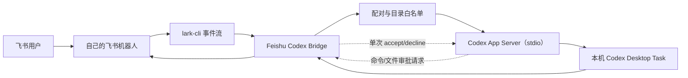

# 架构说明

## 目标

Bridge 只负责把飞书文本消息映射到本机 Codex App Server，不代理账号、不上传凭证、不提供公网服务。



## 模块

| 模块 | 职责 |
|---|---|
| `src/lark` | 消费飞书事件、解析消息、发送回复 |
| `src/codex` | Codex App Server JSON-RPC 客户端 |
| `src/core/router.js` | `tasks/open/status/new/exit`、审批和普通文本路由 |
| `src/core/taskBrowser.js` | Task 搜索、项目过滤和分页 |
| `src/core/accessStore.js` | 一次性配对和用户授权 |
| `src/core/projectStore.js` | 工作目录白名单和 Task 过滤 |
| `src/core/sessionStore.js` | 飞书用户与当前 Task 的本地映射 |
| `src/core/jobManager.js` | 异步执行、阶段状态、单次审批、运行锁和结果推送 |

## 数据边界

本机保存：

- `.env`：Profile 和目录配置
- `.runtime/access.json`：已配对用户标识
- `.runtime/sessions.json`：当前 Task 映射
- `.runtime/*.log`：运行日志

这些文件均不进入 Git。Codex 认证信息仍由 Codex CLI 自己管理。

## Codex 协议

每次调用通过 stdio 启动本机 `codex app-server`，完成初始化后使用：

```text
initialize
thread/list 或 thread/read
thread/resume
turn/start
item/started 与 item/completed
item/commandExecution/requestApproval
item/fileChange/requestApproval
turn/completed
```

项目不启动 WebSocket 监听器，也不把 App Server 暴露到局域网或公网。
