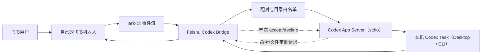

# 架构说明

## 目标

Bridge 只负责把飞书文本消息映射到本机 Codex App Server，不代理账号、不上传凭证、不提供公网服务。



## 模块

| 模块 | 职责 |
|---|---|
| `src/lark` | 消费飞书事件、解析消息、发送回复 |
| `src/codex` | Codex App Server JSON-RPC 客户端 |
| `src/core/router.js` | `tasks/open/status/new/exit`、审批和普通文本路由 |
| `src/core/taskBrowser.js` | Task 搜索、项目过滤和分页 |
| `src/core/taskActivityProbe.js` | 单 Task rollout 活动采样、3 秒缓存和并发合并 |
| `src/core/accessStore.js` | 一次性配对和用户授权 |
| `src/core/projectStore.js` | 工作目录白名单和 Task 过滤 |
| `src/core/sessionStore.js` | 飞书用户与当前 Task 的本地映射 |
| `src/core/jobManager.js` | 异步执行、阶段状态、单次审批、运行锁和结果推送 |

## 数据边界

本机保存：

- `%LOCALAPPDATA%\FeishuCodexBridge\config.env`：Profile 和目录配置
- `runtime/access.json`：已配对用户标识
- `runtime/sessions.json`：当前 Task 映射
- `runtime/*.log`：运行日志
- `runtime/bridge.ready`：飞书事件监听已收到 ready marker
- `runtime/bridge.stop`：管理命令向 Node.js 发出的优雅停止请求

源码兼容模式仍使用项目内 `.env` 和 `.runtime`。全局 npm 包升级不会覆盖用户数据目录。

CLI 升级采用旁路版本目录：

- `install/versions/<版本>`：每个已安装版本的只读程序文件。
- `install/current.json`：当前启用版本指针。
- `install/launcher.mjs`：不随版本目录切换的稳定启动器。
- `install/pending-cleanup.json`：被 Windows 目录锁阻止清理的旧 npm 包记录。

升级先在新目录解压并核对包名、版本和 CLI 输出，再原子更新 `current.json` 与全局命令入口。环境自检或新服务启动失败时恢复旧指针和命令入口；旧 npm 目录清理失败仅告警，不影响切换。

这些文件均不进入 Git。Codex 认证信息仍由 Codex CLI 自己管理。

## Codex 协议

每次调用通过 stdio 启动本机 `codex app-server`，完成初始化后使用：

```text
initialize
thread/list 或 thread/read
thread/resume
turn/start
item/started 与 item/completed
item/commandExecution/requestApproval
item/fileChange/requestApproval
turn/completed
```

项目不启动 WebSocket 监听器，也不把 App Server 暴露到局域网或公网。

`tasks` 先调用 `thread/list`，再在同一个 App Server 中批量 `thread/read` 当前页 Task，并以最多 4 路并行对 rollout 文件执行两次 `stat`，默认间隔 800ms。`open`、外部状态 `status` 和续聊前只读取并探测选中的 Task；不读取 JSONL 正文。Bridge Job 优先使用内存状态，探测结果按 Task 缓存 3 秒并合并并发请求。稳定的 `Interrupted` 使用 5 分钟活动宽限期，超期后视为可续聊。

## 进程生命周期

后台启动会等待 lark-cli 在 stderr 输出固定 ready marker，Bridge 随后写入 `bridge.ready`。`stop.ps1` 写入 `bridge.stop`，Node.js 检测后关闭 lark-cli stdin，使长期监听以 `reason: signal` 正常退出；仅在 15 秒内无法退出时才强制停止 Node.js。
